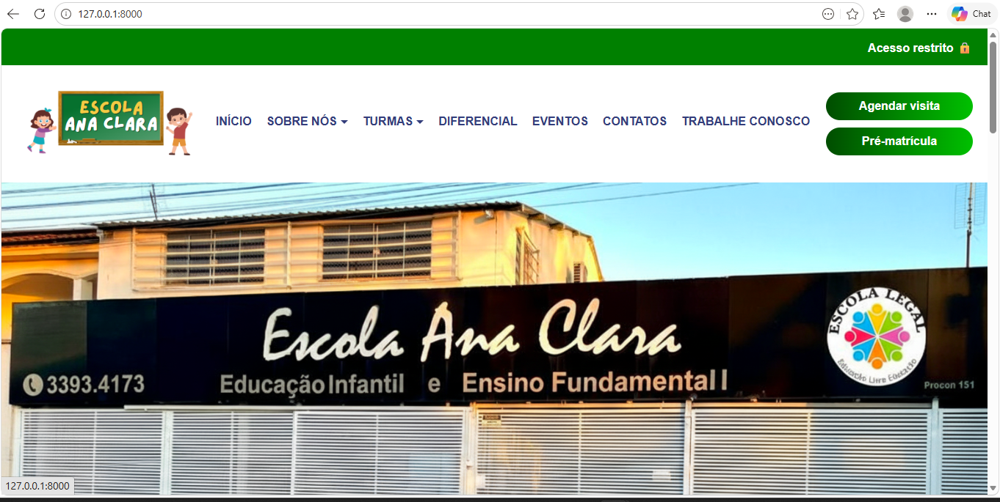
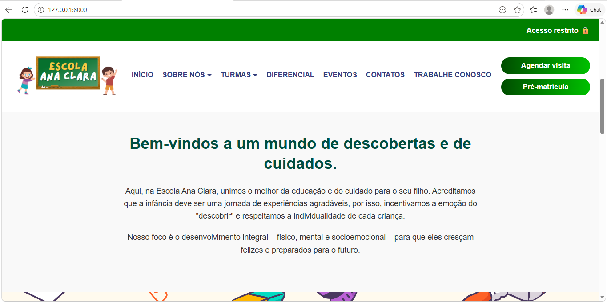
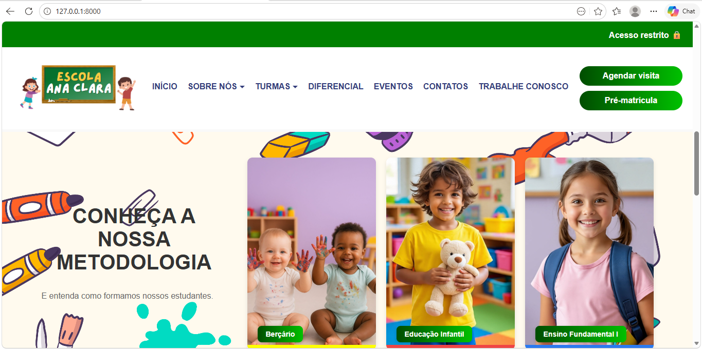
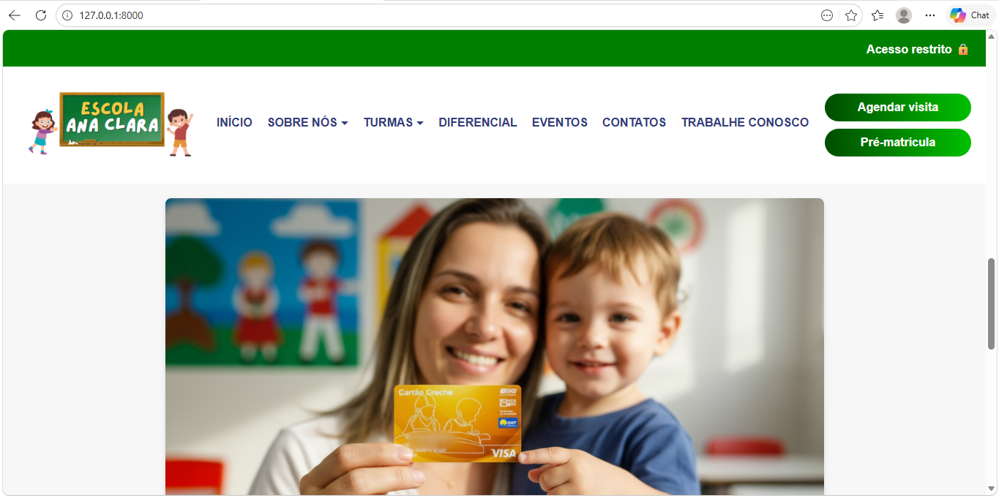
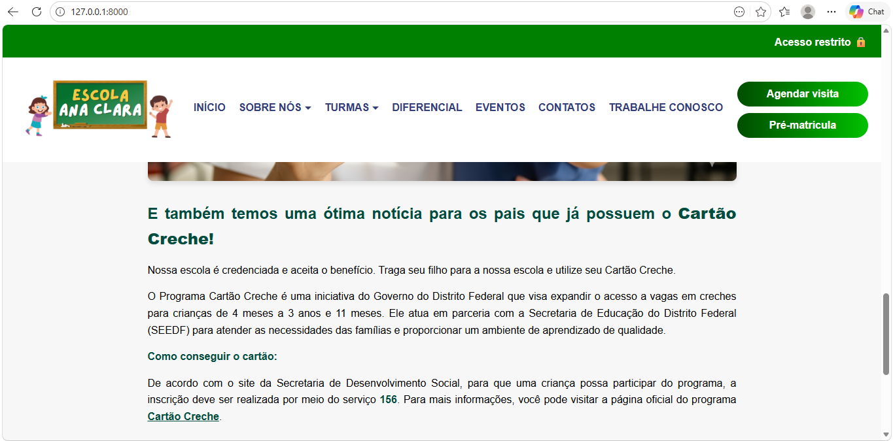
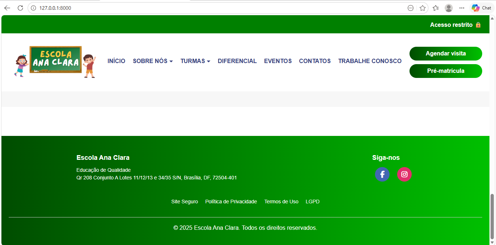

# 🎓 Sistema Escolar - TCC Técnico

Este projeto foi desenvolvido como Trabalho de Conclusão de Curso (TCC), com o objetivo de criar um sistema web para gestão escolar.

## 🚀 Funcionalidades
- Cadastro de alunos
- Gerenciamento de informações
- Área administrativa
- Sistema de contato

## 🛠️ Tecnologias utilizadas
- PHP
- Laravel
- MySQL
- HTML, CSS e JavaScript

## 📸 Imagens do Sistema

## ⚙️ Como executar o projeto

1. Clone o repositório:
git clone https://github.com/Lampiao-Cerrado/Tcc-tecnico.git

2. Acesse a pasta:
cd site-escola

3. Instale as dependências:
composer install

4. Configure o ambiente:
cp .env.example .env

5. Gere a chave da aplicação:
php artisan key:generate

6. Execute o projeto:
php artisan serve

## 📌 Sobre
Projeto acadêmico desenvolvido para conclusão de curso técnico.

## 👨‍💻 Autor
Gustavo Soares Alves